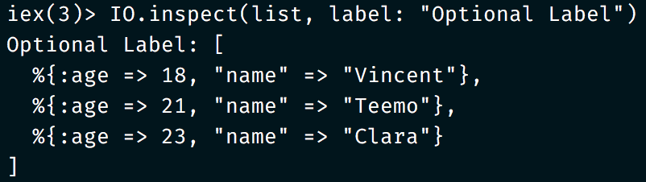

# IO Color

Wrapping your `IO.inspect` and `IO.puts` in vibrant colors since 2018.

No external dependencies.

## Installation

Add `{:io_color, "~> 0.1.0"}` to your dependencies.

```elixir
def deps do
  [
    {:pretty_inspect, "~> 0.1.0"}
  ]
end
```

## Usage

```elixir
list = [
	%{"name" => "Vincent", age: 18},
	%{"name" => "Teemo", age: 21},
	%{"name" => "Clara", age: 23}
]

IOC.inspect(list, "Optional Label")
```

What it looks like:


What your current IO.inspect looks like:




##### Wait, ```IOC.insp```?

All of these will work, choose whichever you like!

```elixir
IOC.insp(list, "optional label")
IOC.inspect(list, "optional label")
IOColor.insp(list, "optional label")
IOColored.insp(list, "optional label")
IOColor.inspect(list, "optional label")
IOColored.inspect(list, "optional label")

# `IO.puts`: accepts one arg only
IOC.puts("Some string")
IOColor.puts("Some string")
IOColored.puts("Some string")
```

##### Will my `|>`s still work?

Of course!

```elixir
conn
|> Map.get(:body_params)
|> IOC.insp("Incoming Body Params")
|> process_body_params
|> IOC.insp("Process result")
|> case do
      # ...
   end
```

##### Custom colors / other commands?

I'm currently putting this here for my personal convenience. Yeah I'm lazy to copy a single module file across all my projects, I know. But if it'll be useful to you to see more features, feel free to put in an issue and pull request, and I'll help what I can. Just saying, it seems that supporting presets (soft or hard) may be better than just custom colors, because the colour combinations are hard to get right.


## Contributing

```bash
# install erlang, elixir

git clone https://github.com/Seiyial/elix_io_color.git
cd io_color
iex -S mix run
```


